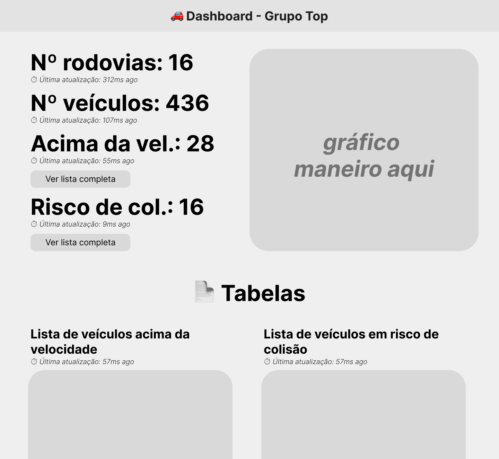

# CompEscalavelA2
Trabalho de computação escalável A2: Projeto de ETL e Dashboard para um sistema de monitoramento de rodovias. Trata-se de um sistema focado em escalabilidade e eficiência, usando Python, Redis e Dash.

## Integrantes
- Breno [...]
- Bruno Fornaro
- Lf Laguardia
- Vanessa Wille
- Vinícius Hedler

## Dashboard

O que eu quero fazer no dashboard:

